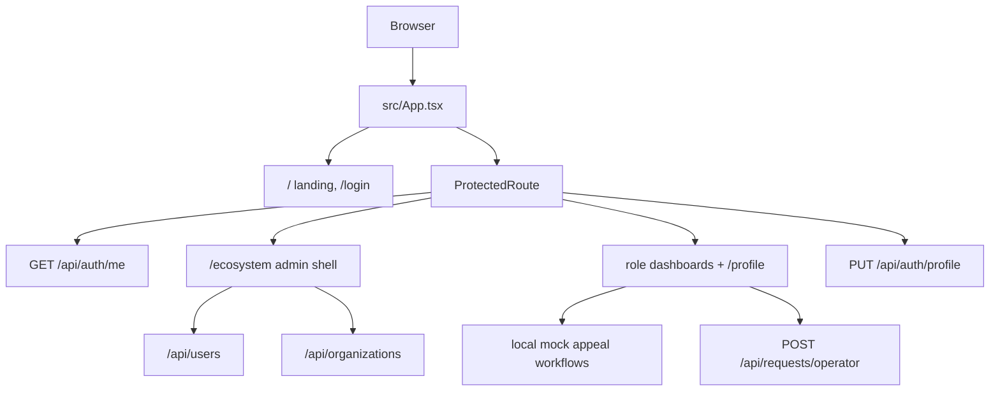

# Architecture Overview

High-level map of the Murojaat24 frontend: a single-page React app with a public landing, cookie-session auth, an admin ecosystem shell, and role dashboards. Most appeal lifecycle UI is still **mock/local**; users, organizations, and profile updates hit the real API.

## System shape

## Main areas

| Area | Entry | Notes |
| --- | --- | --- |
| Public landing | `src/pages/landing/Index.tsx` | Static sections; external citizen appeal URL in header/hero. |
| Login | `src/pages/login/Login.tsx` | Phone + password; redirect by role. |
| Admin ecosystem | `src/modules/ecosystem/layouts/EcosystemLayout.tsx` | All `/ecosystem/*` except routes registered only in `App.tsx`. |
| Murojaat24 admin module | `src/modules/ecosystem/pages/murojaat24/Murojaat24ModulePage.tsx` | Dashboard, appeals list, statistics, users — by pathname. |
| Role dashboards | `src/pages/*-dashboard/`, `specialist-mobile/` | Mock workflow state. |
| Profile | `src/pages/profile/Profile.tsx` | API-backed; admin uses `/ecosystem/profile`. |

## Stack (behavior-relevant)

Vite, React 18, React Router, TanStack Query, react-hook-form + zod, Tailwind + shadcn/ui (Radix), recharts on statistics screens. Path alias `@/` → `src/`.

## Backend boundary

HTTP via `src/lib/api/client.ts` and hooks in `src/lib/api/auth.ts`, `users.ts`, `organizations.ts`, `requests.ts`. Cookie session; JSON success envelope.

## Data reality

| Backed by API | Mock / local only |
| --- | --- |
| Auth session, profile | Operator appeals list |
| Operator appeal create | Dispatcher assignment |
| Staff users CRUD | Specialist tasks & completion |
| Organizations CRUD | Manager approve/reject |
| | Admin appeal list & statistika charts |
| | Settings templates & general toggles |
| | Unmounted citizen submit/track pages |

Feature details live in colocated `src/**/README.md` files (see `AGENTS.md`).
