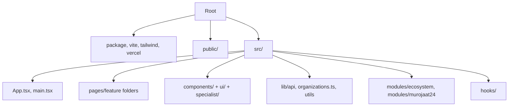

# Project Structure

Folder map for the frontend. Feature behavior is documented in colocated `README.md` files under `src/` (see `AGENTS.md`).

## Tree

## Root

| Path | Purpose |
| --- | --- |
| `package.json` | Scripts and dependencies. |
| `vite.config.ts` | React plugin, `@` alias. |
| `tailwind.config.ts`, `src/index.css` | Tailwind scan paths and CSS variables. |
| `vercel.json` | SPA fallback to `index.html`. |

## `src/pages`

Each feature folder contains the route component(s) and `README.md`.

| Folder | Component(s) | Routed |
| --- | --- | --- |
| `landing/` | `Index.tsx` | `/` |
| `login/` | `Login.tsx` | `/login` |
| `profile/` | `Profile.tsx` | `/profile`, `/ecosystem/profile` |
| `operator-dashboard/` | `OperatorDashboardRoutes`, `OperatorNewAppeal`, `OperatorAppealsList` | `/operator-dashboard/new`, `/list` |
| `dispatcher-dashboard/` | `DispatcherDashboardRoutes.tsx` | `/dispatcher-dashboard/*` |
| `manager-dashboard/` | `ManagerDashboard.tsx` | `/manager-dashboard` |
| `specialist-mobile/` | `SpecialistMobile.tsx` | `/specialist-mobile` — see `specialist-mobile/README.md` |
| `errors/` | `Forbidden.tsx`, `NotFound.tsx` | `Forbidden` via guard; `*` catch-all |
| `citizen/` | `SubmitRequest.tsx`, `TrackRequest.tsx`, `Statistics.tsx` | **Not routed** — see `citizen/README.md` |

## `src/components`

Shared workflow UI: sidebars, modals, map, task cards, user modals, landing sections (`Header`, `Hero`, …).

- `components/ui/` — shadcn primitives.
- `components/specialist/` — specialist mobile tabs (see `src/components/specialist/README.md`).
- `ProtectedRoute.tsx` — auth gate.

## `src/lib`

| Path | Purpose |
| --- | --- |
| `lib/api/client.ts` | `apiRequest`, envelopes, `ApiError`. |
| `lib/api/auth.ts` | Roles, session hooks, redirects. |
| `lib/api/users.ts` | Staff user hooks. |
| `lib/api/organizations.ts` | Organization hooks. |
| `lib/organizations.ts` | Static org list for mock UIs. |
| `lib/utils.ts` | `cn()` helper. |

See `src/lib/api/README.md` for auth/session.

## `src/modules`

| Path | Purpose |
| --- | --- |
| `modules/ecosystem/` | Admin menu, layout, pages — `src/modules/ecosystem/README.md`. |
| `modules/ecosystem/pages/modullar/` | `ModullarPage.tsx` |
| `modules/ecosystem/pages/coming-soon/` | `ComingSoonPage.tsx` |
| `modules/ecosystem/pages/sozlamalar/` | `SozlamalarPage.tsx` |
| `modules/ecosystem/pages/murojaat24/` | `Murojaat24ModulePage.tsx`, section components |
| `modules/murojaat24/` | Route config only — `src/modules/murojaat24/README.md`; screens live under `src/pages/`. |

## `src/hooks`

`use-toast.ts`, `use-mobile.tsx`.
