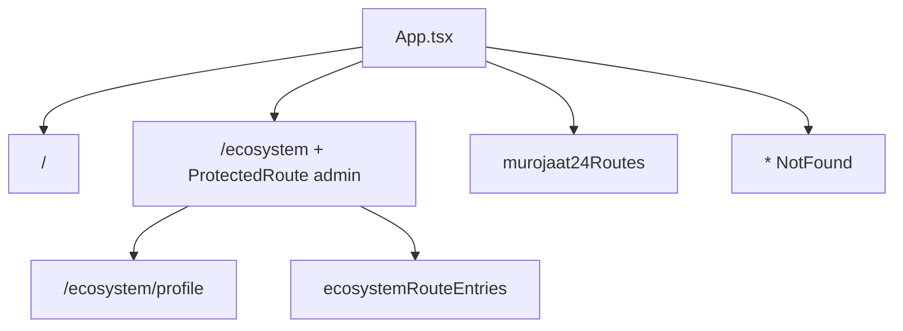

# Routing

Registered routes and role gates. Sources: `src/App.tsx`, `src/modules/murojaat24/config/routes.tsx`, `src/modules/ecosystem/config/menu.ts`.

## Assembly

## Public routes

| Path | Component | Gate |
| --- | --- | --- |
| `/` | `Index` | Public |
| `/login` | `Login` | Public |
| `/role-select` | redirect → `/login` | Public |
| `*` | `NotFound` | Public |

## Murojaat24 role routes

Declared in `src/modules/murojaat24/config/routes.tsx`, wrapped with `ProtectedRoute` in `App.tsx` unless `public: true`.

| Path | Component | Allowed roles |
| --- | --- | --- |
| `/operator-dashboard` | `OperatorDashboard` | `operator`, `admin` |
| `/dispatcher-dashboard` | `DispatcherDashboard` | `dispatcher`, `admin` |
| `/specialist-mobile` | `SpecialistMobile` | `specialist`, `admin` |
| `/manager-dashboard` | `ManagerDashboard` | `manager`, `admin` |
| `/manager/foydalanuvchilar` | `ManagerUsersPage` | `manager`, `admin` |
| `/profile` | `Profile` | all five roles |
| `/admin-dashboard` | redirect → `/ecosystem/modullar` | `admin` |

## Admin ecosystem routes

Parent `/ecosystem` requires `admin` (`ProtectedRoute` in `App.tsx`). Child paths come from `ecosystemMenuItems` flattened to `ecosystemRouteEntries`. `App.tsx` renders by `moduleKind`:

| Path | Page | Kind |
| --- | --- | --- |
| `/ecosystem` | redirect → `modullar` | index |
| `/ecosystem/profile` | `Profile` (embedded) | explicit in `App.tsx` |
| `/ecosystem/modullar` | `ModullarPage` | `modullar` |
| `/ecosystem/murojaat24` | `Murojaat24ModulePage` | `murojaat24` |
| `/ecosystem/murojaat24/murojaatlar` | `Murojaat24ModulePage` | `murojaat24` |
| `/ecosystem/murojaat24/statistika` | `Murojaat24ModulePage` | `murojaat24` |
| `/ecosystem/murojaat24/foydalanuvchilar` | `Murojaat24ModulePage` | `murojaat24` |
| `/ecosystem/sozlamalar` | `SozlamalarPage` | `sozlamalar` |
| `/ecosystem/sozlamalar/rahbariyat` | `SozlamalarPage` | `sozlamalar` |
| `/ecosystem/sozlamalar/tashkilotlar` | `SozlamalarPage` | `sozlamalar` |
| `/ecosystem/sozlamalar/shablonlar` | `SozlamalarPage` | `sozlamalar` |
| `/ecosystem/sozlamalar/umumiy` | `SozlamalarPage` | `sozlamalar` |
| `/ecosystem/toza-hudud`, `/ecosystem/kommunal-chaqiruvlar`, `/ecosystem/nazorat-24`, `/ecosystem/shahar-passporti`, `/ecosystem/hududlar-taqsimoti` (+ children), `/ecosystem/hisobotlar` (+ children), `/ecosystem/sozlamalar/obyekt-turi`, `chaqiruv-turi`, `ish-vaqtlari` | `ComingSoonPage` | `coming-soon` |

Full menu labels and IDs: `src/modules/ecosystem/config/menu.ts`.

## Unregistered pages

Not in `App.tsx` or `murojaat24Routes`: `SubmitRequest`, `TrackRequest`, `Statistics`. Operator sidebar links `/statistika` — also unregistered. See `docs/architecture/gotchas.md` and `src/pages/citizen/README.md`.
