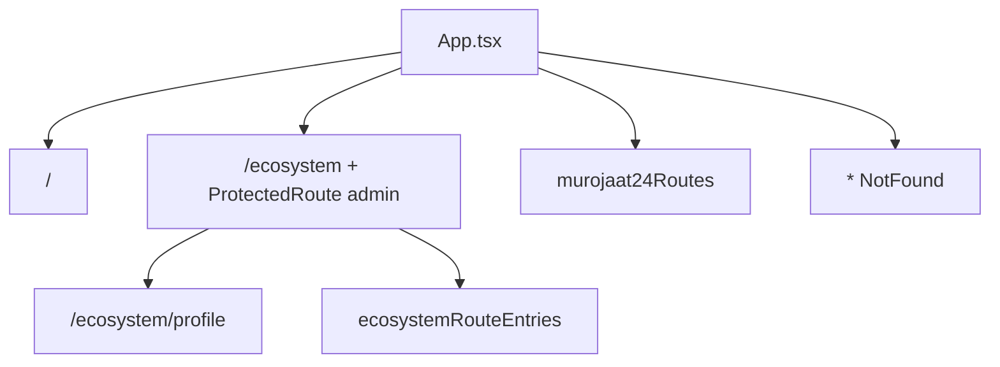

# Routing

Registered routes and role gates. Sources: `src/App.tsx`, `src/modules/murojaat24/config/routes.tsx`, `src/modules/ecosystem/config/menu.ts`.

## Assembly

```mermaid
flowchart TD
  App["App.tsx"] --> Root["/"]
  App --> Eco["/ecosystem + ProtectedRoute admin"]
  App --> M24["murojaat24Routes"]
  App --> NF["* NotFound"]
  Eco --> Profile["/ecosystem/profile"]
  Eco --> Menu["ecosystemRouteEntries"]
```

## Public routes

| Path | Component | Gate |
| --- | --- | --- |
| `/` | `Index` | Public |
| `/login` | `Login` | Public |
| `/role-select` | redirect → `/login` | Public |
| `*` | `NotFound` | Public |

## Murojaat24 role routes

Declared in `src/modules/murojaat24/config/routes.tsx`, wrapped with `ProtectedRoute` in `App.tsx` unless `public: true`.

| Path | Component | Allowed roles |
| --- | --- | --- |
| `/operator-dashboard/*` | `OperatorDashboardRoutes` → `new`, `list` | `operator`, `admin` |
| `/dispatcher-dashboard/*` | `DispatcherDashboardRoutes` | `dispatcher`, `admin` |
| `/specialist-mobile` | `SpecialistMobile` | `specialist`, `admin` |
| `/manager/review` | `ManagerReviewPage` | `manager`, `admin` |
| `/manager/statistics` | `ManagerStatisticsPage` | `manager`, `admin` |
| `/manager-dashboard` | Redirect → `/manager/review` | `manager`, `admin` |
| `/manager/users` | `ManagerUsersPage` | `manager`, `admin` |
| `/profile` | `Profile` | all five roles |
| `/admin-dashboard` | redirect → `/ecosystem/modules` | `admin` |

### Specialist login (not a separate route)

Logged-in `specialist` on `/login` renders `MobileQRCode` until PWA install and permissions succeed, unless `shouldBypassSpecialistInstallWall()` (`src/lib/pwa.ts`). Then navigation goes to `/specialist-mobile`. See `docs/roles/specialist.md`.

## Admin ecosystem routes

Parent `/ecosystem` requires `admin` (`ProtectedRoute` in `App.tsx`). Child paths come from `ecosystemMenuItems` flattened to `ecosystemRouteEntries`. `App.tsx` renders by `moduleKind`:

| Path | Page | Kind |
| --- | --- | --- |
| `/ecosystem` | redirect → `modules` | index |
| `/ecosystem/profile` | `Profile` (embedded) | explicit in `App.tsx` |
| `/ecosystem/modules` | `ModullarPage` | `modullar` |
| `/ecosystem/murojaat24` | `Murojaat24ModulePage` | `murojaat24` |
| `/ecosystem/murojaat24/appeals` | `Murojaat24ModulePage` | `murojaat24` |
| `/ecosystem/murojaat24/statistics` | `Murojaat24ModulePage` | `murojaat24` |
| `/ecosystem/murojaat24/users` | `Murojaat24ModulePage` | `murojaat24` |
| `/ecosystem/settings` | `SozlamalarPage` | `sozlamalar` |
| `/ecosystem/settings/leadership` | `SozlamalarPage` | `sozlamalar` |
| `/ecosystem/settings/organizations` | `SozlamalarPage` | `sozlamalar` |
| `/ecosystem/settings/templates` | `SozlamalarPage` | `sozlamalar` |
| `/ecosystem/settings/general` | `SozlamalarPage` | `sozlamalar` |
| `/ecosystem/clean-territory`, `/ecosystem/utility-calls`, `/ecosystem/supervision-24`, `/ecosystem/city-passport`, `/ecosystem/territory-distribution` (+ children), `/ecosystem/reports` (+ children), `/ecosystem/settings/object-types`, `call-types`, `work-hours` | `ComingSoonPage` | `coming-soon` |

Full menu labels and IDs: `src/modules/ecosystem/config/menu.ts`.

## Unregistered pages

Not in `App.tsx` or `murojaat24Routes`: `SubmitRequest`, `TrackRequest`, `Statistics`. See `docs/architecture/gotchas.md` and `src/pages/citizen/README.md`.
