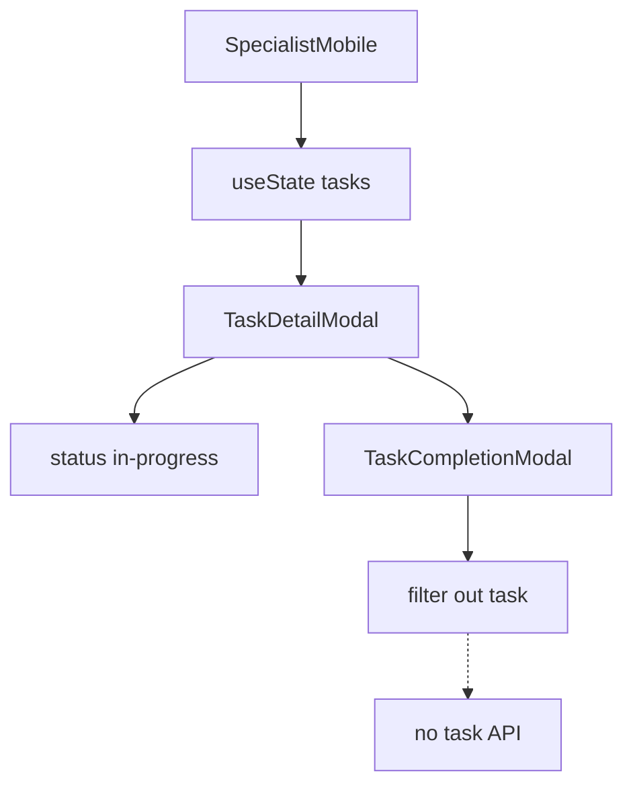

# Specialist mobile workflow

Mobile-width task experience on `/specialist-mobile`: active tasks, bottom navigation (tasks / history / stats / profile), task detail and multi-step completion. Task state is local; profile editing uses the shared Profile page and auth API.

## User-facing behavior

Specialist sees assigned tasks, opens detail, accepts new work, calls or navigates to citizen, completes with photo + report + signature, then task disappears from the list. History and stats tabs show static demo data. Profile tab links to `/profile` for API-backed edits and logout.

## Entry points

| Concern | Path |
| --- | --- |
| Page shell | `src/pages/specialist-mobile/SpecialistMobile.tsx` |
| Bottom nav | `src/components/BottomNavigation.tsx` |
| Task UI | `TaskCard.tsx`, `TaskDetailModal.tsx` |
| Completion | `specialist/TaskCompletionModal.tsx` |
| Tabs | `HistoryTab.tsx`, `StatsTab.tsx`, `ProfileTab.tsx` |
| Modals | `HistoryDetailModal.tsx`, `ChangePasswordModal.tsx` |
| Profile page | `src/pages/profile/README.md` |

## Data flow

## Roles

`specialist`, `admin`. Greeting/avatar from `useCurrentUser`.

## Edge cases

- Empty task list message when no tasks.
- Completion steps enforce image (step 1) and report text (step 2).
- Signature canvas can be cleared.
- `tel:` and Google Maps open from task detail.
- Change-password modal is local validation only — no API call found in repo.
- `ProfileTab` may access user fields before load completes — see gotchas.

## Related docs

- Role: `docs/roles/specialist.md`
- Auth: `src/lib/api/README.md`
