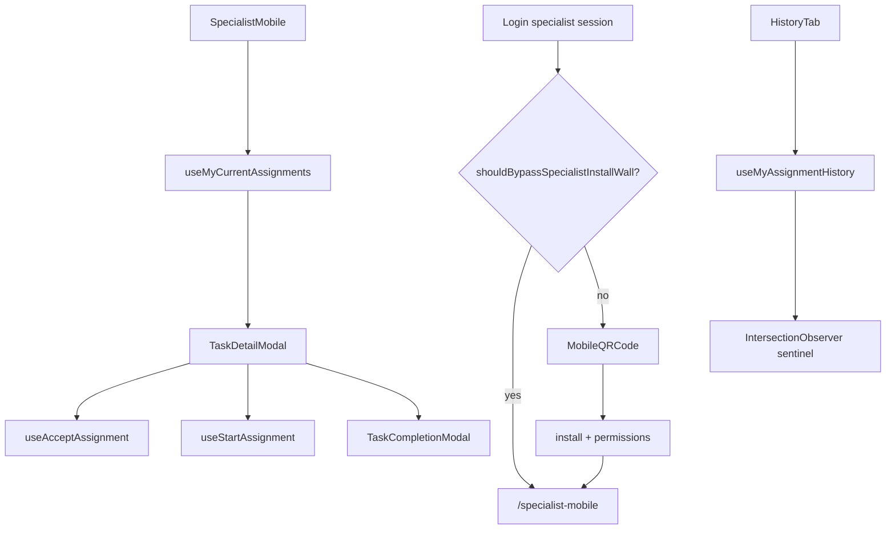

# Specialist mobile workflow

Components for the specialist experience: post-login **PWA install gate** (`MobileQRCode`) and the **in-app tabs** used by `src/pages/specialist-mobile/SpecialistMobile.tsx`. Active tasks and history use `src/lib/api/assignments.ts`; profile editing uses `/profile` and auth API.

## User-facing behavior

**Login gate (`MobileQRCode`):** After specialist login, desktop users see a QR to open `/login` on a phone; mobile users walk through install → standalone app → notifications/camera/location, then redirect to `/specialist-mobile`. Logout returns to `/`.

**In-app (`SpecialistMobile`):** Assigned tasks from API, detail, accept/start, complete with photo + report + signature via `useSubmitRequestCompletion` (`POST` images, `PUT` complete). History tab paginates via infinite scroll. Stats tab uses `GET /api/statistics/specialist/{id}` (and `GET /api/statistics/monthly` for the Oy chart). Profile tab links to `/profile` for real edits and API logout.

## Entry points

| Concern | Path |
| --- | --- |
| Page shell | `src/pages/specialist-mobile/SpecialistMobile.tsx` |
| Post-login PWA gate | `MobileQRCode.tsx` (from `src/pages/login/Login.tsx`) |
| Bottom nav | `src/components/BottomNavigation.tsx` |
| Task UI | `../TaskCard.tsx`, `../TaskDetailModal.tsx` |
| Completion | `TaskCompletionModal.tsx` |
| Tabs | `HistoryTab.tsx`, `StatsTab.tsx`, `ProfileTab.tsx` |
| Modals | `HistoryDetailModal.tsx`, `ChangePasswordModal.tsx` |
| Profile page | `src/pages/profile/README.md` |

**Unused in router/UI:** `PersonalInfoModal.tsx` (demo defaults, local save only) — not imported anywhere; specialists use `/profile` instead.

## Data flow

## Specialist PWA install gate

| Helper (`src/lib/pwa.ts`) | Purpose |
| --- | --- |
| `shouldBypassSpecialistInstallWall()` | `true` in Vite dev or when `VITE_BYPASS_SPECIALIST_PWA_WALL=true` |
| `shouldEnableSpecialistPwa(role)` | Register `/sw.js` when specialist + mobile + wall active |
| `isStandalonePwa()` | Detect installed/standalone display mode |
| `getSpecialistPermissionStatus` / `requestSpecialistPermissions` | Notification, camera, geolocation |
| `registerSpecialistPwa` / `unregisterSpecialistPwa` | SW register on gate; unregister on logout |

Persisted access: `localStorage` key `specialist_pwa_permissions_granted`. `/specialist-mobile` does not re-check this key — only `ProtectedRoute` role gate.

## API wiring

Schemas and paths: `docs/api/openapi.json` (Assignments tag). Hooks in `src/lib/api/assignments.ts`:

- `GET /api/assignments/my/current` — active task list
- `GET /api/assignments/my/history` — history tab (`useInfiniteQuery`, default `limit` 10)
- `PUT /api/assignments/{id}/accept`, `PUT /api/assignments/{id}/start` — task lifecycle

**History infinite scroll:** `HistoryTab` renders a sentinel `div`; when it enters the viewport, `fetchNextPage()` runs. Next page uses `pagination.hasNext`, `pagination.pages`, or a full page of rows as fallback.

Completion: `TaskCompletionModal` → `POST /api/requests/:id/images` then `PUT /api/requests/:id/complete` (`src/lib/api/requests.ts`). Requires `requestId` on the task (from assignment).

## Roles

`specialist`, `admin` on `/specialist-mobile`. Greeting/avatar from `useCurrentUser`.

## Edge cases

- Empty task list message when no tasks.
- Completion steps enforce image (step 1) and report text (step 2); signature canvas can be cleared.
- `tel:` and Google Maps from task detail.
- `HistoryTab` period filter is UI-only — does not filter API rows.
- Change-password modal: local validation + toast only (not forgot-password API).
- `ProfileTab` may read `user.profile` before `user` is defined while loading — see `docs/architecture/gotchas.md`.
- SW cache name in `public/sw.js` may differ from `SPECIALIST_PWA_CACHE` in `pwa.ts` (unregister only deletes the constant in `pwa.ts`).

## Related docs

- Page: `src/pages/specialist-mobile/README.md`
- Role: `docs/roles/specialist.md`
- Auth: `src/lib/api/README.md`
- Gaps: `docs/architecture/implementation-gaps.md`
