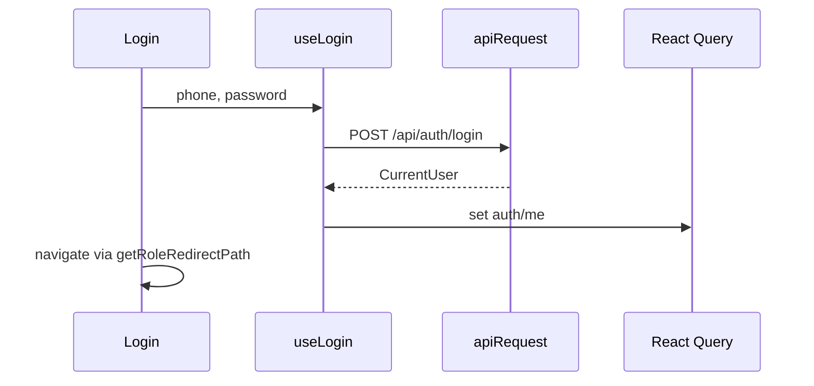

# API hooks (`src/lib/api`)

HTTP client and TanStack Query hooks for the backend. **Contract:** `docs/api/openapi.json` (refresh: `docs/api/refresh-openapi.sh`). Base URL: `VITE_BASE_URL` in `client.ts`.

## Authentication (API & session)

Cookie-based employee auth: login, current user, logout, profile update, and forgot-password hooks. Route guards and login UI live outside this folder but depend on these hooks.

## User-facing behavior

Staff sign in with phone + password on `/login`. Successful login redirects by role. Protected screens load only after `GET /api/auth/me` succeeds. Profile dropdowns offer logout and profile navigation.

## Entry points

| Concern | Path |
| --- | --- |
| Hooks & roles | `auth.ts` |
| Appeals (list + operator create) | `requests.ts` |
| File uploads | `uploads.ts` |
| HTTP transport | `client.ts` |
| Login page | `src/pages/login/Login.tsx` |
| Route guard | `src/components/ProtectedRoute.tsx` |
| Profile update | `src/pages/profile/Profile.tsx` (see `src/pages/profile/README.md`) |
| Route list | `src/modules/murojaat24/config/routes.tsx` |

## Data flow

`ProtectedRoute` uses `useCurrentUser` before rendering children. Non-OK session → `/login` or `Forbidden`.

## Roles

All five roles. Redirect targets defined in `getRoleRedirectPath` in `auth.ts`.

## Edge cases

- Authenticated user visiting `/login` is redirected away.
- Login errors show destructive toast; `ApiError` message preferred when available.
- Logout clears `["auth", "me"]` and legacy `localStorage` keys.
- Forgot-password hooks exist in `auth.ts`; wiring on UI may be partial — verify `Login.tsx` before documenting new flows.

## Appeals (`requests.ts`)

`useRequests` → `GET /api/requests/` with optional query params: `page`, `limit`, `status`, `organization`, `priority`, `search`, `startDate`, `endDate`. React Query key `["requests", params]`. Pass `options.role` of `operator` to strip `organization` from the query string (`omitOrganizationForRole`); admin passes all filters including `organization`. Filter labels: `REQUEST_STATUS_OPTIONS`, `REQUEST_PRIORITY_OPTIONS`. Helpers `getTodayDateRange()` (`date-fns` `format`, `yyyy-MM-dd`), `formatRequestTime()` (`HH:mm`), and `formatRequestDateTime()` (`dd.MM.yyyy HH:mm`) for list display.

`useCreateOperatorRequest` → `POST /api/requests/operator` (operator/admin session). On success invalidates `["requests"]`. Mapper `toOperatorCreatePayload` builds `citizenName`, `citizenPhone` (`normalizePhone`), `organization` (id), `description`, `address.full`. Used by `src/pages/operator-dashboard/` — see that folder's README.

`useRequest(id)` → `GET /api/requests/:id` when `id` is set. React Query key `["requests", "detail", id]`. Used by `OperatorRequestDetailModal` (operator appeals list and admin `MurojaatlarSection`).

## Related docs

- Operator intake: `src/pages/operator-dashboard/README.md`
- Profile page (avatar upload): `src/pages/profile/README.md`
- Avatar upload: `useUploadAvatar` in `uploads.ts` → `POST /api/uploads/avatar`; profile save uses URL via `useUpdateProfile` in `auth.ts`
- Conventions: `docs/architecture/conventions.md`
