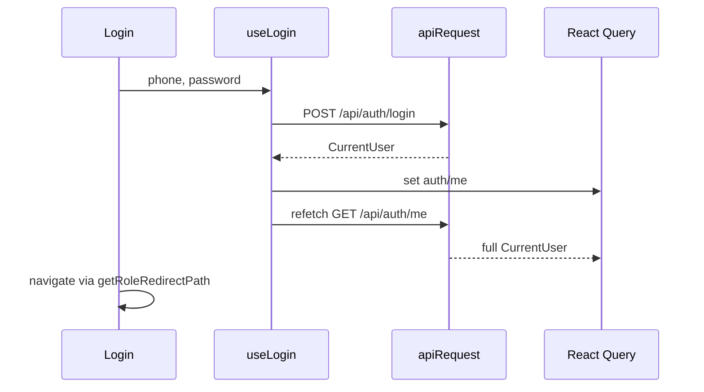

# API hooks (`src/lib/api`)

HTTP client and TanStack Query hooks for the backend. **Contract:** `docs/api/openapi.json` (refresh: `docs/api/refresh-openapi.sh`). Base URL: `VITE_BASE_URL` in `client.ts`.

Unit tests for pure helpers and transport live in colocated `*.test.ts` files; run `npm test` from the repo root.

## Authentication (API & session)

Cookie-based employee auth: login, current user, logout, profile update, and forgot-password hooks. Route guards and login UI live outside this folder but depend on these hooks.

## User-facing behavior

Staff sign in with phone + password on `/login`. Successful login redirects by role. Protected screens load only after `GET /api/auth/me` succeeds. Profile dropdowns offer logout and profile navigation.

## Entry points

| Concern | Path |
| --- | --- |
| Hooks & roles | `auth.ts` |
| Appeals (list + operator create) | `requests.ts` |
| Assignments (dispatcher) | `assignments.ts` |
| Admin statistics | `statistics.ts` |
| File uploads | `uploads.ts` |
| HTTP transport | `client.ts` |
| Login page | `src/pages/login/Login.tsx` |
| Route guard | `src/components/ProtectedRoute.tsx` |
| Profile update | `src/pages/profile/Profile.tsx` (see `src/pages/profile/README.md`) |
| Route list | `src/modules/murojaat24/config/routes.tsx` |

## Data flow

`ProtectedRoute` uses `useCurrentUser` before rendering children. Non-OK session → `/login` or `Forbidden`.

## Roles

All five roles. Redirect targets defined in `getRoleRedirectPath` in `auth.ts`.

## Edge cases

- Authenticated user visiting `/login` is redirected away.
- Login errors show destructive toast; `ApiError` message preferred when available.
- Login refetches `["auth", "me"]` after seeding cache (login body may omit profile fields used on `/profile`).
- Logout removes `["auth", "me"]`, invalidates all queries, and clears legacy `localStorage` keys.
- Forgot-password hooks exist in `auth.ts`; wiring on UI may be partial — verify `Login.tsx` before documenting new flows.

## Appeals (`requests.ts`)

`useRequests` → `GET /api/requests/` with optional query params: `page`, `limit`, `status`, `organization`, `priority`, `search`, `startDate`, `endDate`. React Query key `["requests", params]`. Pass `options.role` of `operator` to strip `organization` from the query string (`omitOrganizationForRole`); admin passes all filters including `organization`. Filter labels: `REQUEST_STATUS_OPTIONS`, `REQUEST_PRIORITY_OPTIONS`. Helpers `getTodayDateRange()` (`date-fns` `format`, `yyyy-MM-dd`), `formatRequestTime()` (`HH:mm`), and `formatRequestDateTime()` (`dd.MM.yyyy HH:mm`) for list display.

`useCreateOperatorRequest` → `POST /api/requests/operator` (operator/admin session). On success invalidates `["requests"]`. Mapper `toOperatorCreatePayload` builds `citizenName`, `citizenPhone` (`normalizePhone`), `organization` (id), `description`, `address.full`. Used by `src/pages/operator-dashboard/` — see that folder's README.

`useRequest(id)` → `GET /api/requests/:id` when `id` is set. React Query key `["requests", "detail", id]`. Used by `OperatorRequestDetailModal` (operator appeals list and admin `MurojaatlarSection`).

`useVerifyRequest` → `PUT /api/requests/:id/verify` with body `{ status: "approved" | "rejected", comment? }`. On success invalidates `["requests"]`, detail, and `["statistics"]`. Used by `ReviewModal` on the manager review page.

Specialist completion (see `docs/api/openapi.json`):

| Hook / helper | Endpoint | Notes |
| --- | --- | --- |
| `uploadRequestImages` | `POST /api/requests/:id/images` | `FormData` field `images` per file; `extractRequestImagePaths` normalizes response paths |
| `useUploadRequestImages` | same | Mutation wrapper |
| `completeRequest` | `PUT /api/requests/:id/complete` | Body `{ images: string[], report, signature }` — signature is PNG data URL from canvas |
| `useCompleteRequest` | same | Invalidates `["requests"]`, detail, `["assignments"]`, `["statistics"]` |
| `submitRequestCompletion` / `useSubmitRequestCompletion` | upload then complete | Used by `TaskCompletionModal` |

Consumer: `src/components/specialist/TaskCompletionModal.tsx`.

## Assignments (`assignments.ts`)

| Hook | Endpoint | Notes |
| --- | --- | --- |
| `useAssignments(params)` | `GET /api/assignments/` | Query: `page`, `limit`, `status`, `specialistId` |
| `useAssignment(id)` | `GET /api/assignments/:id` | Detail when `id` set |
| `useCreateAssignment` | `POST /api/assignments` | Body: `requestId`, `specialistId`, optional `notes`, `estimatedTime` |
| `useCancelAssignment` | `PUT /api/assignments/:id/cancel` | Optional body `{ reason }` |
| `useMyCurrentAssignments` | `GET /api/assignments/my/current` | Specialist active tasks |
| `useMyAssignmentHistory` | `GET /api/assignments/my/history` | `useInfiniteQuery`; `page`, `limit` query |
| `useAcceptAssignment` | `PUT /api/assignments/:id/accept` | Invalidates `["assignments"]`, `["requests"]` |
| `useStartAssignment` | `PUT /api/assignments/:id/start` | Same invalidation as accept |

Helpers: `resolveAssignmentRequestNumber`, `resolveAssignmentSpecialistName`, `canCancelAssignment`, `ASSIGNMENT_STATUS_OPTIONS`, `mapAssignmentToSpecialistTask`, `mapAssignmentToSpecialistHistoryItem`, `formatAssignmentRelativeTime`. Consumers: `src/pages/dispatcher-dashboard/`, `src/pages/specialist-mobile/`, `src/components/specialist/HistoryTab.tsx`.

### Specialist mobile (partial)

Task list, accept, start, completion, and **stats** tab are API-backed (`assignments.ts`, `requests.ts`, `useSpecialistDetailStatistics`). Role doc: `docs/roles/specialist.md`.

## Specialists (`users.ts`)

`useSpecialists(params)` wraps `useUsers` with `role=specialist` and default `isActive: true`. `getStaffUserDisplayName` formats list labels. Used by `AssignModal` and dispatcher assignments table.

## Statistics (`statistics.ts`)

| Hook | Endpoint | Notes |
| --- | --- | --- |
| `useDailyStatistics(days)` | `GET /api/statistics/daily` | Normalizes to `{ date, received, completed }[]` for charts |
| `useOrganizationStatistics` | `GET /api/statistics/by-organization` | Organization pie + admin Rahbariyat block |
| `useSpecialistStatistics` | `GET /api/statistics/specialists` | Rankings list; manager statistics page |
| `useSpecialistDetailStatistics` | `GET /api/statistics/specialist/{id}?days=` | Specialist mobile `StatsTab` (`days` 1 / 7 / 30 by period) |
| `useMonthlyStatistics` | `GET /api/statistics/monthly?year=` | Specialist `StatsTab` chart when period is **Oy** |
| `useExportStatistics` | `GET /api/statistics/export` | Blob download; query `startDate`, `endDate`, `organization` |
| `useDashboardStatistics` | `GET /api/statistics/dashboard` | KPI counts for requests (manager review + statistics pages) |

Helpers: `normalizeDailyStatistics`, `normalizeOrganizationStatistics`, `normalizeSpecialistStatistics`, `mapStatisticsToChartSeries`, `groupOrganizationStatisticsByGovernance`, `downloadStatisticsExport`. Consumers: `StatisticsSection.tsx` (admin), `ManagerStatisticsPage.tsx`, `ManagerReviewPage.tsx`.

## Related docs

- Operator intake: `src/pages/operator-dashboard/README.md`
- Dispatcher appeals/assignments: `src/pages/dispatcher-dashboard/README.md`
- Specialist mobile (mock tasks, planned hooks above): `src/pages/specialist-mobile/README.md`
- Manager review & statistics: `src/pages/manager-dashboard/README.md`
- Profile page (avatar upload): `src/pages/profile/README.md`
- Avatar upload: `useUploadAvatar` in `uploads.ts` → `POST /api/uploads/avatar`; profile save uses URL via `useUpdateProfile` in `auth.ts`
- Conventions: `docs/architecture/conventions.md`
