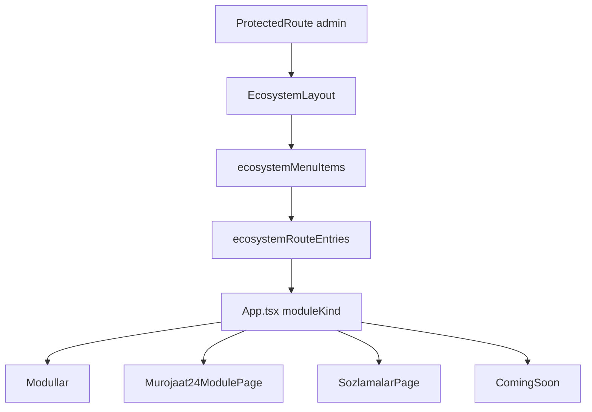

# Admin ecosystem shell

Admin-only `/ecosystem` layout: sidebar menu, module catalog, nested routes for Murojaat24, settings, and coming-soon placeholders.

## User-facing behavior

After login as `admin`, user lands on module grid (`modullar`), navigates sidebar to Murojaat24 or Sozlamalar sections, or opens placeholder modules. Header shows date/time; mobile uses sheet menu.

## Entry points

| Concern | Path |
| --- | --- |
| Router nest | `src/App.tsx` (`/ecosystem`) |
| Menu + flat routes | `src/modules/ecosystem/config/menu.ts` |
| Layout | `src/modules/ecosystem/layouts/EcosystemLayout.tsx` |
| Module grid | `src/modules/ecosystem/pages/modullar/ModullarPage.tsx` |
| Placeholder | `src/modules/ecosystem/pages/coming-soon/ComingSoonPage.tsx` |
| Admin profile | `/ecosystem/profile` in `App.tsx` |

Child feature READMEs:

- Murojaat24 sections: `pages/murojaat24/README.md`
- Settings: `pages/sozlamalar/README.md`

## Data flow

`moduleKind` values: `modullar`, `murojaat24`, `sozlamalar`, `coming-soon`. Sidebar uses `getVisibleEcosystemMenuItems()` to hide `coming-soon` entries; routes still exist for placeholders.

## Roles

`admin` only on the parent route. Other roles use standalone dashboards under `murojaat24/config/routes.tsx`.

## Edge cases

- Paths not in the flattened menu fall through to global `NotFound`.
- `/ecosystem/profile` is registered in `App.tsx`, not generated from the menu tree.
- Coming-soon pages resolve label from active menu entry.

## Related docs

- Routing table: `docs/architecture/routing.md`
- Admin role: `docs/roles/admin.md`
