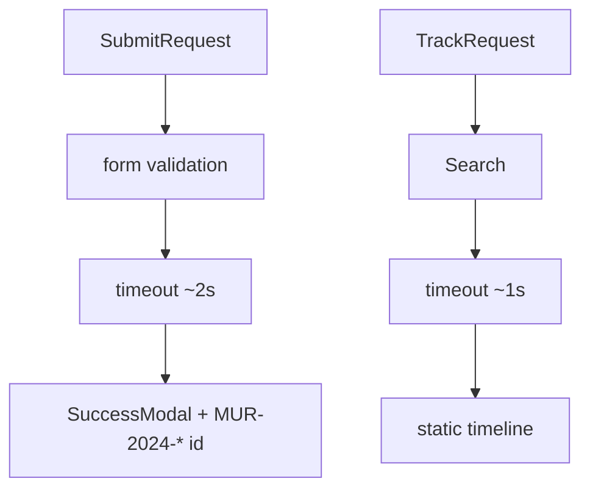

# Unrouted citizen pages

Public-facing submit, track, and statistics **page components** that exist in `src/pages/` but are **not mounted** in the router. The live landing sends citizens to an external appeal site instead.

## Components

| File | Intended UX |
| --- | --- |
| `src/pages/citizen/SubmitRequest.tsx` | Citizen appeal form, image upload, geolocation button, success modal |
| `src/pages/citizen/TrackRequest.tsx` | Tracking number search → mock timeline |
| `src/pages/citizen/Statistics.tsx` | Large standalone statistics dashboard (local data) |

Shared UI: `ImageUpload`, `SuccessModal`, `TrackingTimeline`, `RequestDetailsCard`, `RequestProblemSection`, `Header`, `Footer`.

## Data flow (submit / track)

No routes in `App.tsx` or `murojaat24Routes` point to these files.

## Roles

None via router — components are public in design only. Employees use `/login` and role dashboards.

## Edge cases

- Submit geolocation may write a hardcoded address after browser success.
- Image upload max 5MB, image MIME types in `ImageUpload.tsx`.
- Track search no-ops on blank input.
- `Statistics.tsx` may have unused imports under relaxed TS settings.

## Related docs

- Landing external CTA: `src/pages/landing/README.md`
- Gotchas: `docs/architecture/gotchas.md`
