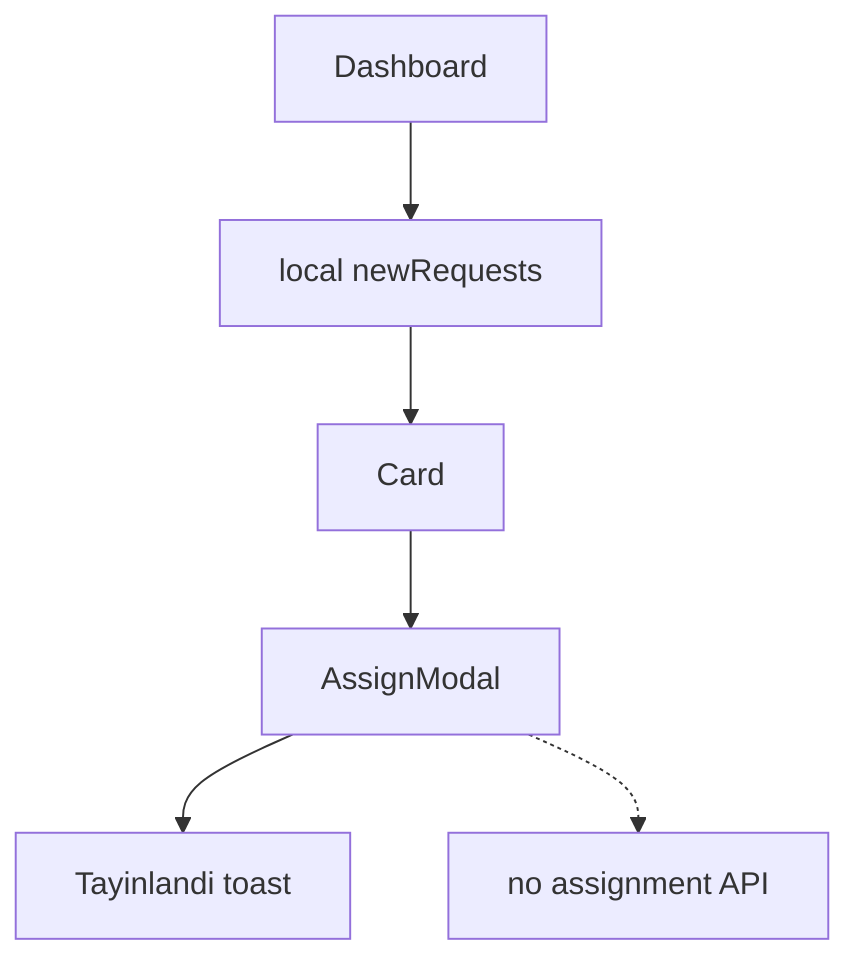

# Dispatcher monitoring and assignment

Dashboard for new appeals, map-style markers, specialist availability, and assignment modal on `/dispatcher-dashboard`. Assignment confirms with a toast only.

## User-facing behavior

Dispatcher sees cards for waiting appeals, opens “Yo'naltirish”, picks a specialist, confirms. Map and specialist panels show mock live data. Daily stat cards are static.

## Entry points

| Route | File |
| --- | --- |
| `/dispatcher-dashboard` | `src/pages/dispatcher-dashboard/DispatcherDashboard.tsx` |
| Sidebar | `src/components/DispatcherSidebar.tsx` |
| Cards | `src/components/NewRequestCard.tsx` |
| Modal | `src/components/AssignModal.tsx` |
| Map | `src/components/MapView.tsx` |
| Specialists | `src/components/SpecialistCard.tsx` |

## Data flow

## Roles

`dispatcher`, `admin`.

## Edge cases

- Assign button disabled until specialist selected; selection cleared after success.
- Map markers use percentage positions, not real coordinates API.
- Sidebar hash links (`#new`, `#map`, …) may not scroll to ids on the page.

## Related docs

- Role: `docs/roles/dispatcher.md`
