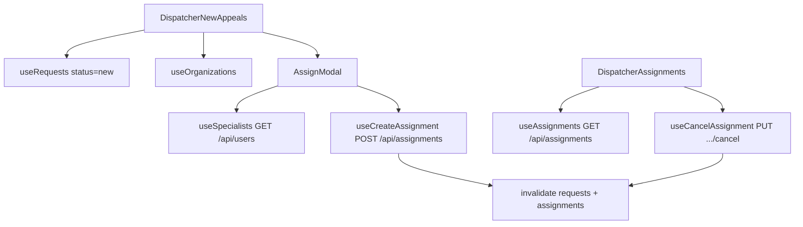

# Dispatcher appeals and assignments

Dispatcher workflow for assigning new appeals to specialists and managing active assignments on `/dispatcher-dashboard/*`. Data is API-backed via `requests.ts`, `assignments.ts`, and `users.ts`.

## User-facing behavior

- **Yangi murojaatlar** (`/dispatcher-dashboard/appeals`): paginated table of appeals with `status=new`, scoped to the signed-in dispatcher’s organization (`useCurrentUser` → `organization` query param). Row actions: view detail (`OperatorRequestDetailModal`), assign specialist (`AssignModal` with optional `notes` and `estimatedTime` → `POST /api/assignments`).
- **Topshiriqlar** (`/dispatcher-dashboard/assignments`): paginated assignments list with optional status filter. Cancel opens `AlertDialog` confirmation, then `PUT /api/assignments/:id/cancel`.
- Sidebar shows only the two menu items above (no map, stats, or monitoring).

## Entry points

| Route | File |
| --- | --- |
| `/dispatcher-dashboard/*` | `DispatcherDashboardRoutes.tsx` |
| Layout + sidebar | `DispatcherLayout.tsx`, `src/components/DispatcherSidebar.tsx` |
| New appeals | `DispatcherNewAppeals.tsx` |
| Assignments | `DispatcherAssignments.tsx` |
| Assign modal | `src/components/AssignModal.tsx` |

## Data flow

## API hooks

| Hook | Endpoint |
| --- | --- |
| `useRequests` | `GET /api/requests/` |
| `useSpecialists` | `GET /api/users?role=specialist` |
| `useAssignments` | `GET /api/assignments/` |
| `useAssignment` | `GET /api/assignments/:id` |
| `useCreateAssignment` | `POST /api/assignments` |
| `useCancelAssignment` | `PUT /api/assignments/:id/cancel` |

Contract: `docs/api/openapi.json`. Shared client patterns: `src/lib/api/README.md`.

## Roles

`dispatcher`, `admin`. Post-login home for dispatcher: `/dispatcher-dashboard/appeals` (`getRoleRedirectPath` in `auth.ts`).

## Edge cases

- Assign requires `request._id` from the list API; disabled when missing.
- Specialists list can be scoped by appeal organization (`organizations` query on users).
- Cancel is only enabled for `pending`, `accepted`, and `in-progress` assignments.
- Request/specialist fields on assignments may be string ids or populated objects; helpers in `assignments.ts` resolve display labels.

## Related docs

- Role: `docs/roles/dispatcher.md`
- API hooks: `src/lib/api/README.md`
- Gaps snapshot: `docs/architecture/implementation-gaps.md`
