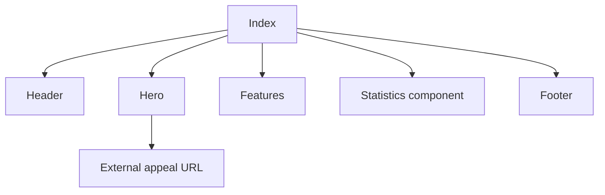

# Public landing

Marketing home page for Termiz aqlli shahar at `/`. Static content; employee login link; citizen appeals go to an **external** site, not in-app submit.

## User-facing behavior

Visitors see hero, service cards, statistics band, footer, and header with login. “Murojaat qoldirish” opens the external citizen portal URL (configured in `Header` / `Hero`), not `SubmitRequest.tsx`.

## Entry points

| Route | Page |
| --- | --- |
| `/` | `src/pages/landing/Index.tsx` |

Sections: `Header`, `Hero`, `Features`, `Statistics` (landing stats, not `pages/Statistics.tsx`), `Footer`.

## Data flow

No API calls for content. Copy and figures are local arrays inside section components.

## Roles

Public — no auth required. Header does not show authenticated profile controls.

## Edge cases

- Mobile nav uses local open/closed state in `Header`.
- Landing `Statistics` is unrelated to unmounted `src/pages/citizen/Statistics.tsx`.

## Related docs

- Unmounted citizen pages: `src/pages/citizen/README.md`
- Auth: `src/lib/api/README.md`
