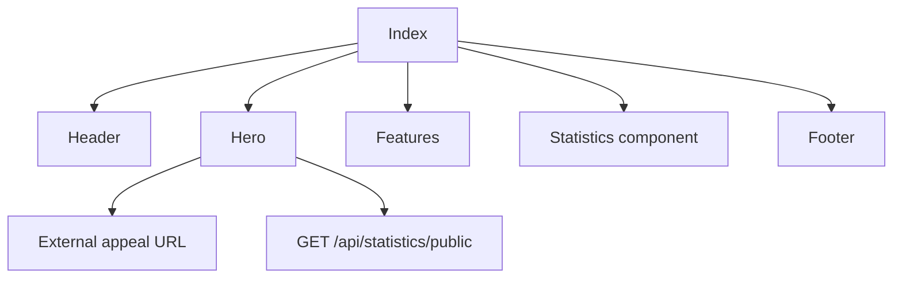

# Public landing

Marketing home page for Termiz aqlli shahar at `/`. Static content; employee login link; citizen appeals go to an **external** site, not in-app submit.

## User-facing behavior

Visitors see hero, service cards, statistics band, footer, and header with login. “Murojaat qoldirish” opens the external citizen portal URL (configured in `Header` / `Hero`), not `SubmitRequest.tsx`.

## Entry points

| Route | Page                          |
| ----- | ----------------------------- |
| `/`   | `src/pages/landing/Index.tsx` |

Sections: `Header`, `Hero`, `Features`, `Statistics` (landing stats, not `pages/Statistics.tsx`), `Footer`.

## Data flow

```mermaid
flowchart TD
  Index --> Header
  Index --> Hero
  Index --> Features
  Index --> Stats["Statistics component"]
  Index --> Footer
  Hero --> External["External appeal URL"]
  Hero --> PublicStats["GET /api/statistics/public"]
```

Hero trust-card figures load from `GET /api/statistics/public` via `usePublicStatistics` in `src/lib/api/statistics.ts` (`overview.today`, `overview.completed`, `overview.verified`). Other sections still use local copy; the `Statistics` band below remains static placeholders until wired separately.

The header test-mode marquee (`TestModeBanner`) renders only after client mount and uses `data-nosnippet` so crawlers are less likely to index that copy for SEO.

## Roles

Public — no auth required. Header does not show authenticated profile controls.

## Edge cases

- Mobile nav uses local open/closed state in `Header`.
- Landing `Statistics` is unrelated to unmounted `src/pages/citizen/Statistics.tsx`.

## Related docs

- Unmounted citizen pages: `src/pages/citizen/README.md`
- Auth: `src/lib/api/README.md`
