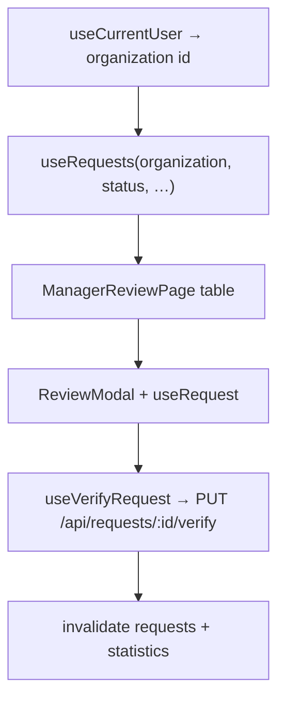

# Manager dashboard

API-backed review queue and statistics for the manager role. Staff user management lives in `src/pages/manager-users/`.

## User-facing behavior

- **Nazorat qilish** (`/manager/nazorat`): appeals list scoped to the signed-in manager’s organization (`GET /api/requests/` with `organization`), default status filter `completed`, search and status tabs, KPI cards from `GET /api/statistics/dashboard`. Row opens `ReviewModal` for verify/reject.
- **Statistika** (`/manager/statistika`): dashboard KPIs, daily line chart, organization pie (scoped to manager org when id is known), specialist bar chart and table, Excel export for the manager organization.
- **Foydalanuvchilar** (`/manager/foydalanuvchilar`): see `src/pages/manager-users/README.md`.

`/manager-dashboard` redirects to `/manager/nazorat` for old links.

## Entry points

| Route | File |
| --- | --- |
| `/manager/nazorat` | `ManagerReviewPage.tsx` |
| `/manager/statistika` | `ManagerStatisticsPage.tsx` |
| `/manager/*` shell | `ManagerLayout.tsx`, `ManagerDashboardRoutes.tsx` |
| Sidebar | `src/components/ManagerSidebar.tsx` |
| Review modal | `src/components/ReviewModal.tsx` |

## Data flow

Verify body: `{ status: "approved" | "rejected", comment? }`. Approve/reject only when request `status` is `completed`.

## Roles

`manager`, `admin`. Managers cannot use `/ecosystem/*`. Admins opening manager routes see lists without forced organization filter unless their profile has an organization id.

## API caveat (statistics)

Statistics endpoints (`daily`, `specialists`, `dashboard`) do not yet accept an `organization` query param. Charts use API data as returned; the organization pie is client-filtered when the manager profile has an org id. When the backend adds org scoping, pass the manager organization id in those hooks (same pattern as `useRequests`).

## Edge cases

- Manager without `organization` on profile: list query disabled; error message shown.
- Review actions hidden when status is not `completed`.
- Verify errors surface via destructive toast (`ApiError`).
- Statistics export requires organization id on the manager profile.
- Reject comment is optional on verify.

## Related docs

- Staff users: `src/pages/manager-users/README.md`
- API hooks: `src/lib/api/requests.ts`, `src/lib/api/statistics.ts`
- Role: `docs/roles/manager.md`
