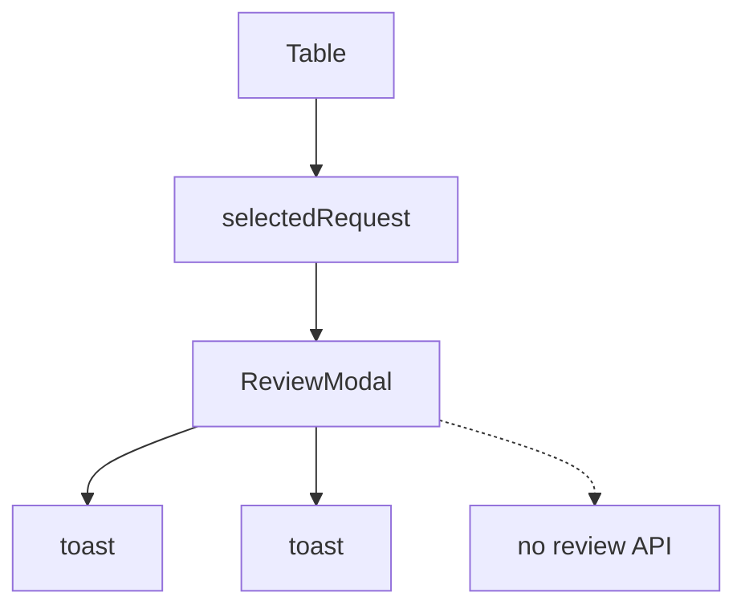

# Manager review

Completed-work review table and approve/reject modal on `/manager-dashboard`. Actions are toast-only — no review API.

## User-facing behavior

Manager sees KPI cards and a table of work awaiting review, opens a row for before/after images, report, signature, and timeline, then approves or rejects.

## Entry points

| Route | File |
| --- | --- |
| `/manager-dashboard` | `src/pages/manager-dashboard/ManagerDashboard.tsx` |
| Sidebar | `src/components/ManagerSidebar.tsx` |
| Modal | `src/components/ReviewModal.tsx` |

## Data flow

Local `reviewRequests` array defined in the dashboard page.

## Roles

`manager`, `admin`. Managers do not get `/ecosystem` user-admin routes.

## Edge cases

- Modal mounts only when a request is selected.
- Approve/reject both close modal after toast.
- Optional before/after images hidden when URLs missing.

## Related docs

- Staff users (dispatcher/specialist): `src/pages/manager-users/README.md`
- Role: `docs/roles/manager.md`
