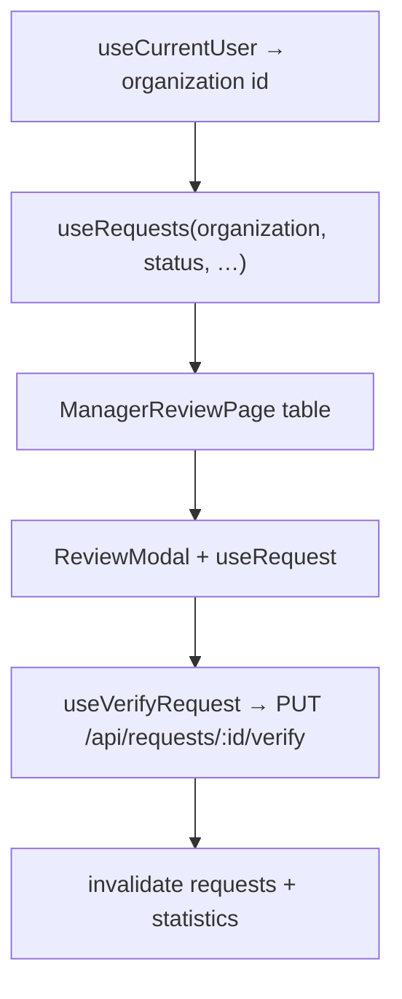

# Manager dashboard

API-backed review queue and statistics for the manager role. Staff user management lives in `src/pages/manager-users/`.

## User-facing behavior

- **Nazorat qilish** (`/manager/review`): appeals list scoped to the signed-in manager’s organization (`GET /api/requests/` with `organization`), default status filter **Barcha holatlar**, search and status dropdown, KPI cards from `GET /api/statistics/dashboard`. Table includes citizen name column and an amber **Qaytarilgan** badge when `incorrectOrganization` is true. Row opens `ReviewModal` for verify/reject.
- **Statistika** (`/manager/statistics`): dashboard KPIs, daily line chart, organization pie (scoped to manager org when id is known), specialist bar chart and table, Excel export for the manager organization.
- **Foydalanuvchilar** (`/manager/users`): see `src/pages/manager-users/README.md`.

`/manager-dashboard` redirects to `/manager/review` for old links.

## Entry points

| Route                 | File                                              |
| --------------------- | ------------------------------------------------- |
| `/manager/review`     | `ManagerReviewPage.tsx`                           |
| `/manager/statistics` | `ManagerStatisticsPage.tsx`                       |
| `/manager/*` shell    | `ManagerLayout.tsx`, `ManagerDashboardRoutes.tsx` |
| Sidebar               | `src/components/ManagerSidebar.tsx`               |
| Review modal          | `src/components/ReviewModal.tsx`                  |

## Data flow

```mermaid
flowchart TD
  Org["useCurrentUser → organization id"]
  Org --> List["useRequests(organization, status, …)"]
  List --> Table["ManagerReviewPage table"]
  Table --> Modal["ReviewModal + useRequest"]
  Modal --> Verify["useVerifyRequest → PUT /api/requests/:id/verify"]
  Verify --> Invalidate["invalidate requests + statistics"]
```

Verify body: `{ status: "approved" | "rejected", comment? }`. When a request was returned for wrong organization (`incorrectOrganization: true` on list/detail), `ReviewModal` shows an info note; operator reassigns organization via `OperatorEditRequestModal` on `new` appeals. Wrong-org return API (`PUT /api/requests/:id` with `{ incorrectOrganization: true }`) remains in `useReturnRequestForWrongOrganization` for future UI.

`ReviewModal` left column: initial `description` and `images`; right column: `completionData` (`report`, `images`, `signature`, `completedAt` on `AppealRequestDetail`).

## Roles

`manager`, `admin`. Managers cannot use `/ecosystem/*`. Admins opening manager routes see lists without forced organization filter unless their profile has an organization id.

## API caveat (statistics)

Statistics endpoints (`daily`, `specialists`, `dashboard`) do not yet accept an `organization` query param. Charts use API data as returned; the organization pie is client-filtered when the manager profile has an org id. When the backend adds org scoping, pass the manager organization id in those hooks (same pattern as `useRequests`).

## Edge cases

- Manager without `organization` on profile: list query disabled; error message shown.
- Verify/reject shown only when request `status` is `completed`.
- Info note in `ReviewModal` when `incorrectOrganization` is true on the detail response.
- Verify errors surface via destructive toast (`ApiError`).
- Statistics export requires organization id on the manager profile.
- Reject comment is optional on verify.

## Related docs

- Staff users: `src/pages/manager-users/README.md`
- API hooks: `src/lib/api/requests.ts`, `src/lib/api/statistics.ts`
- Role: `docs/roles/manager.md`
