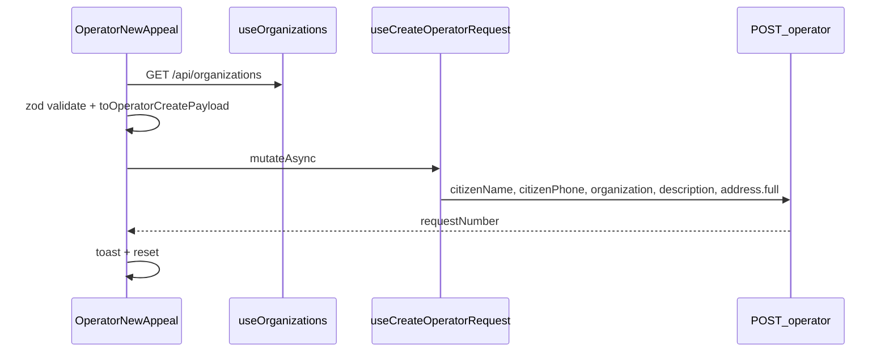
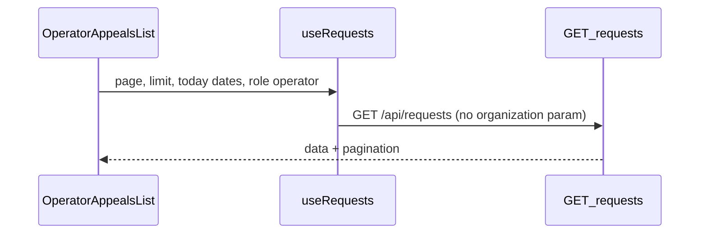
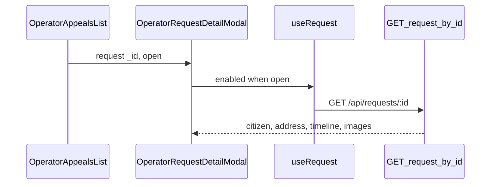

# Operator appeal intake

Phone intake form backed by `POST /api/requests/operator`, plus today's appeals list via `GET /api/requests/`.

## User-facing behavior

**New appeal** (`/operator-dashboard/new`): operator enters citizen details, picks an organization from the API, saves, sees a success toast with the server `requestNumber`, form resets.

**Appeals list** (`/operator-dashboard/list`): static KPI cards; table loads today's appeals via `useRequests` (`startDate`/`endDate` = today, `organization` query param omitted for operator role). Organization names resolved from `useOrganizations`. Row **Eye** opens `OperatorRequestDetailModal` → `useRequest` → `GET /api/requests/:id`; appeal photos open full-size in `ImagePreviewDialog` on click.

`/operator-dashboard` redirects to `new`.

## Entry points

| Route | File |
| --- | --- |
| `/operator-dashboard/*` | `OperatorDashboardRoutes.tsx` (nested router) |
| `/operator-dashboard/new` | `OperatorNewAppeal.tsx` |
| `/operator-dashboard/list` | `OperatorAppealsList.tsx` |
| Layout | `OperatorLayout.tsx` |
| Sidebar | `src/components/OperatorSidebar.tsx` |

Organizations for the combobox: `useOrganizations()` → `GET /api/organizations` (organization `_id` sent in the create payload).

## Data flow

Payload omits `images`, `priority`, address sub-fields, and coordinates.

Phone is displayed as `+998 90 123 45 67` and normalized to `+998901234567` before POST (`src/lib/phone.ts`).

Auth: `useCurrentUser` for sidebar/profile menu; create requires cookie session (`operator` or `admin`).

## Roles

`operator`, `admin`.

## Sidebar navigation

`OperatorSidebar` links to `/operator-dashboard/new` (Yangi murojaat) and `/operator-dashboard/list` (Murojaatlar ro'yxati). Admin statistics live under `/ecosystem/murojaat24/statistika`, not in the operator shell.

## Edge cases

- Description min 20 / max 1000 characters (matches backend validation).
- Organization combobox disabled while org list loads or on fetch error.
- `ApiError` message shown in destructive toast on submit failure.

## Related docs

- API hooks: `src/lib/api/requests.ts`, `src/lib/api/README.md`
- Role: `docs/roles/operator.md`
- Gotchas: `docs/architecture/gotchas.md`
