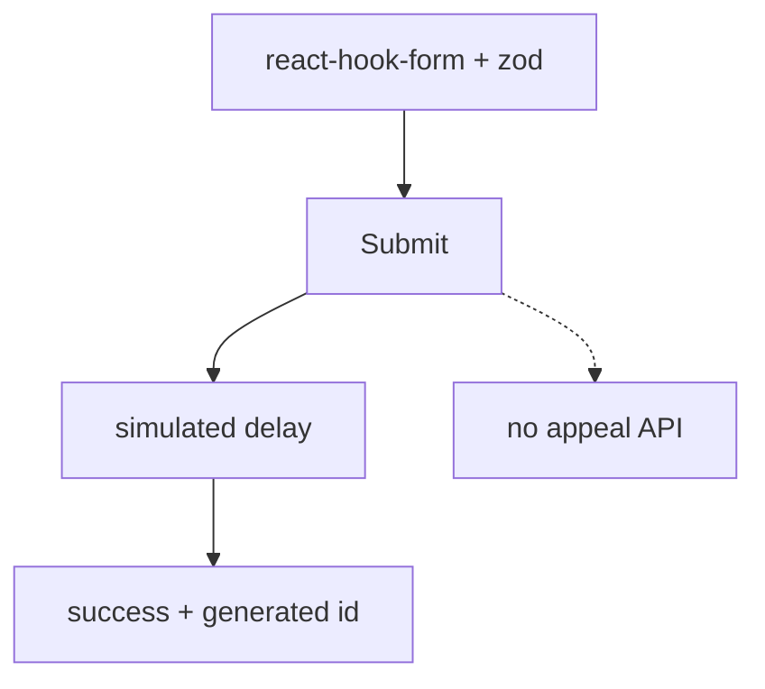

# Operator appeal intake

Phone intake form and mock list of today’s appeals on `/operator-dashboard`. Submit does **not** call an appeals API.

## User-facing behavior

Operator enters citizen details and organization, saves, sees success toast with a generated `MUR-2024-*` style number, form resets. Dashboard shows static KPIs and a mock request table below the form.

## Entry points

| Route | File |
| --- | --- |
| `/operator-dashboard` | `src/pages/operator-dashboard/OperatorDashboard.tsx` |
| Sidebar | `src/components/OperatorSidebar.tsx` |

Organizations for the combobox: static list in `src/lib/organizations.ts` (not `GET /api/organizations` on this screen).

## Data flow

Auth: `useCurrentUser` for sidebar/profile menu only.

## Roles

`operator`, `admin`.

## Edge cases

- Phone field normalizes to Uzbek `+998 …` format.
- Organization combobox empty state when no match.
- Sidebar link to `/statistika` is not a registered route.
- Hash nav links may not match page section ids.

## Related docs

- Role: `docs/roles/operator.md`
- Gotchas: `docs/architecture/gotchas.md`
