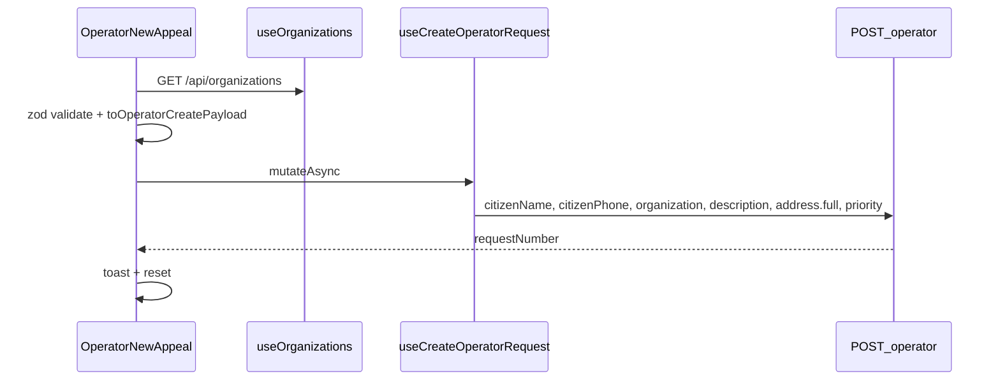
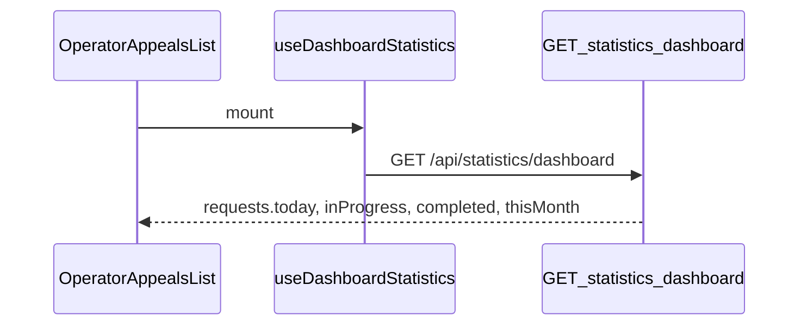
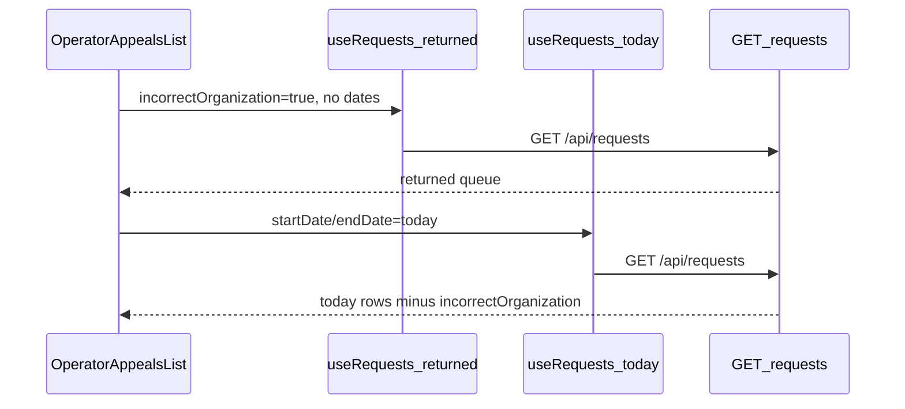
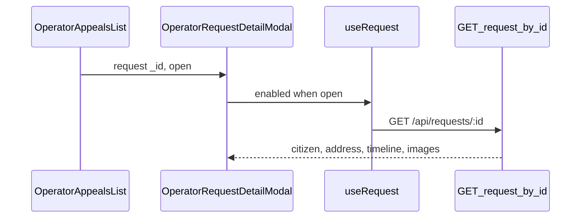
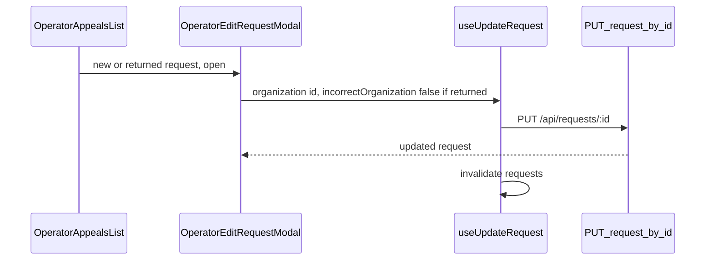

# Operator appeal intake

Phone intake form backed by `POST /api/requests/operator`, plus today's appeals list via `GET /api/requests/`.

## User-facing behavior

**New appeal** (`/operator-dashboard/new`): operator enters citizen details, picks an organization and priority, saves, sees a success toast with the server `requestNumber`, form resets.

**Appeals list** (`/operator-dashboard/list`): KPI cards from `useDashboardStatistics` → `GET /api/statistics/dashboard` (`today`, `inProgress`, `completed`+`verified`, `thisMonth`). **Returned queue:** amber card **Qaytarilgan murojaatlar** above today's table when `useRequests({ incorrectOrganization: true })` returns rows (all dates, no `startDate`/`endDate`); hidden when empty. **Today's table:** `useRequests` with today's date range; rows with `incorrectOrganization` are excluded client-side so they appear only in the returned card. Organization names from `useOrganizations`. Row **Eye** opens detail modal; row **Pencil** opens `OperatorEditRequestModal` for **`new`** or **returned** appeals → `PUT /api/requests/:id` with `{ organization }` (and `incorrectOrganization: false` when clearing a return).

`/operator-dashboard` redirects to `new`.

## Entry points

| Route                      | File                                          |
| -------------------------- | --------------------------------------------- |
| `/operator-dashboard/*`    | `OperatorDashboardRoutes.tsx` (nested router) |
| `/operator-dashboard/new`  | `OperatorNewAppeal.tsx`                       |
| `/operator-dashboard/list` | `OperatorAppealsList.tsx`                     |
| Layout                     | `OperatorLayout.tsx`                          |
| Sidebar                    | `src/components/OperatorSidebar.tsx`          |

Organizations for the combobox: `useOrganizations()` → `GET /api/organizations` (organization `_id` sent in the create payload).

## Data flow

```mermaid
sequenceDiagram
  participant Form as OperatorNewAppeal
  participant Orgs as useOrganizations
  participant Hook as useCreateOperatorRequest
  participant API as POST_operator

  Form->>Orgs: GET /api/organizations
  Form->>Form: zod validate + toOperatorCreatePayload
  Form->>Hook: mutateAsync
  Hook->>API: citizenName, citizenPhone, organization, description, address.full, priority
  API-->>Form: requestNumber
  Form->>Form: toast + reset
```

```mermaid
sequenceDiagram
  participant List as OperatorAppealsList
  participant Stats as useDashboardStatistics
  participant API as GET_statistics_dashboard

  List->>Stats: mount
  Stats->>API: GET /api/statistics/dashboard
  API-->>List: requests.today, inProgress, completed, thisMonth
```

```mermaid
sequenceDiagram
  participant List as OperatorAppealsList
  participant Returned as useRequests_returned
  participant Today as useRequests_today
  participant API as GET_requests

  List->>Returned: incorrectOrganization=true, no dates
  Returned->>API: GET /api/requests
  API-->>List: returned queue

  List->>Today: startDate/endDate=today
  Today->>API: GET /api/requests
  API-->>List: today rows minus incorrectOrganization
```

```mermaid
sequenceDiagram
  participant List as OperatorAppealsList
  participant Modal as OperatorRequestDetailModal
  participant Hook as useRequest
  participant API as GET_request_by_id

  List->>Modal: request _id, open
  Modal->>Hook: enabled when open
  Hook->>API: GET /api/requests/:id
  API-->>Modal: citizen, address, timeline, images
```

```mermaid
sequenceDiagram
  participant List as OperatorAppealsList
  participant Modal as OperatorEditRequestModal
  participant Hook as useUpdateRequest
  participant API as PUT_request_by_id

  List->>Modal: new or returned request, open
  Modal->>Hook: organization id, incorrectOrganization false if returned
  Hook->>API: PUT /api/requests/:id
  API-->>Modal: updated request
  Hook->>Hook: invalidate requests
```

Payload omits `images`, address sub-fields, and coordinates. Default priority in the form is `medium` (API default).

Phone is displayed as `+998 90 123 45 67` and normalized to `+998901234567` before POST (`src/lib/phone.ts`).

Auth: `useCurrentUser` for header profile menu; create requires cookie session (`operator` or `admin`).

## Roles

`operator`, `admin`.

## Sidebar navigation

`OperatorSidebar` links to `/operator-dashboard/new` (Yangi murojaat) and `/operator-dashboard/list` (Murojaatlar ro'yxati). Admin statistics live under `/ecosystem/murojaat24/statistics`, not in the operator shell.

## Edge cases

- Description min 20 / max 1000 characters (matches backend validation).
- Organization combobox disabled while org list loads or on fetch error.
- Returned appeals card hidden when the `incorrectOrganization=true` query returns no rows.
- Edit (pencil) enabled when `status` is `new` or `incorrectOrganization` is true; returned saves also send `incorrectOrganization: false`.
- `ApiError` message shown in destructive toast on submit failure.

## Related docs

- API hooks: `src/lib/api/requests.ts`, `src/lib/api/README.md`
- Role: `docs/roles/operator.md`
- Gotchas: `docs/architecture/gotchas.md`
