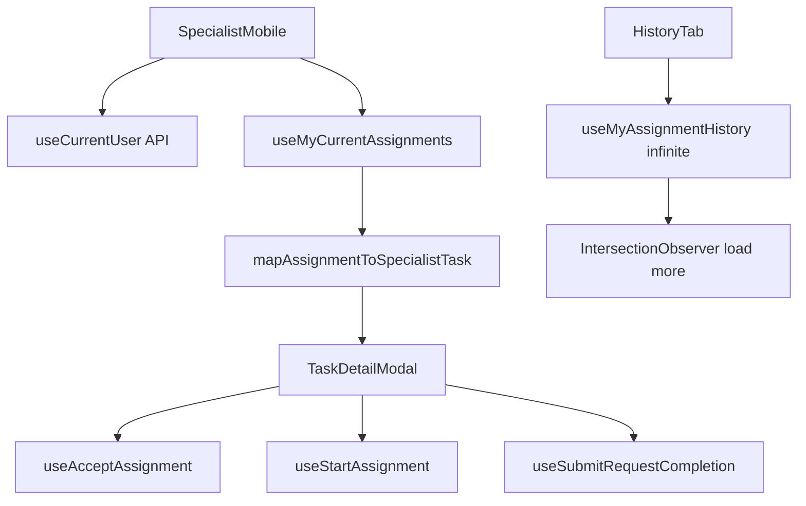

# Specialist mobile (`/specialist-mobile`)

Mobile-width shell for the **specialist** role: task list, bottom navigation, and tabbed history/stats/profile. Route: `src/modules/murojaat24/config/routes.tsx` → `ProtectedRoute` roles `specialist`, `admin`.

## User-facing behavior

Header shows name and avatar from the session. **Tasks** tab lists active assignments from `GET /api/assignments/my/current`; tapping opens `TaskDetailModal` (call, maps, accept, start, completion). **History** loads `GET /api/assignments/my/history` with infinite scroll. **Stats** still shows static demo content. **Profile** tab links to `/profile` for API-backed edits and logout.

Specialists normally reach this page after login + PWA gate on `/login`; in dev the gate is bypassed (see `src/components/specialist/README.md`). Direct navigation to `/specialist-mobile` is allowed when authenticated — install wall is not enforced on this route.

## Entry points

| File | Role |
| --- | --- |
| `SpecialistMobile.tsx` | Page shell, API tasks, tab state, modals |
| `src/components/BottomNavigation.tsx` | Tab bar: tasks, history, stats, profile |
| `src/components/TaskCard.tsx` | Task list card |
| `src/components/TaskDetailModal.tsx` | Detail, accept, start, open completion |
| `src/components/specialist/*` | Tabs and completion flow — see `src/components/specialist/README.md` |

## Data flow

## API vs mock

| Area | Source |
| --- | --- |
| Header user | `useCurrentUser` |
| Task list / accept / start | `assignments.ts` — `my/current`, accept, start |
| History tab | `useMyAssignmentHistory` + infinite scroll |
| Completion modal | `useSubmitRequestCompletion` — `POST` images, `PUT` complete |
| Stats tab | `useSpecialistDetailStatistics` + `useMonthlyStatistics` (Oy period) |
| Profile edits | `/profile` page (API) |

Contract: `docs/api/openapi.json` (Assignments tag). Gaps: `docs/architecture/implementation-gaps.md`.

## Roles

`specialist`, `admin`. Admin can open this UI for testing without being a specialist.

## Edge cases

- Empty task list shows a dedicated message; loading uses skeletons.
- Assignment `request` may be a string id or populated object; mappers handle both.
- `pending` → accept; `accepted` → start; `in-progress` → completion modal (`POST` images + `PUT` complete).
- Tasks without `requestId` cannot open the completion modal.
- History period `Select` is UI-only — does not filter API rows yet.
- Rating/comment in history detail are empty when the API omits them.

## Related docs

- Role: `docs/roles/specialist.md`
- Components: `src/components/specialist/README.md`
- Login / PWA: `src/pages/login/Login.tsx`, `src/lib/pwa.ts`
- Auth: `src/lib/api/README.md`
